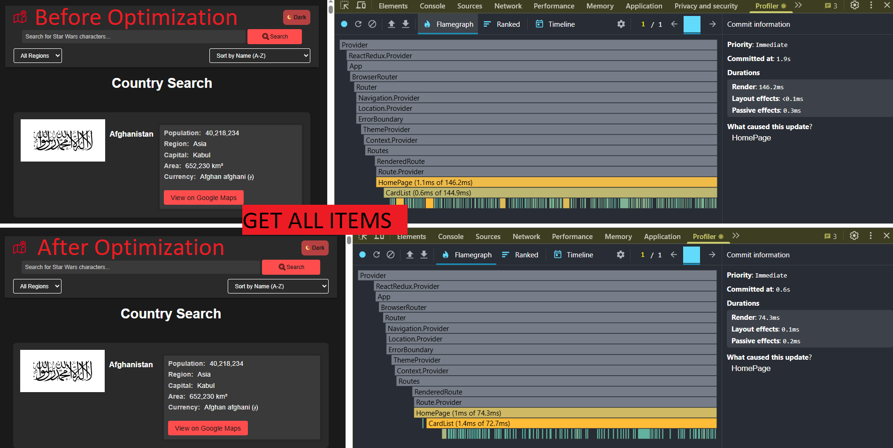
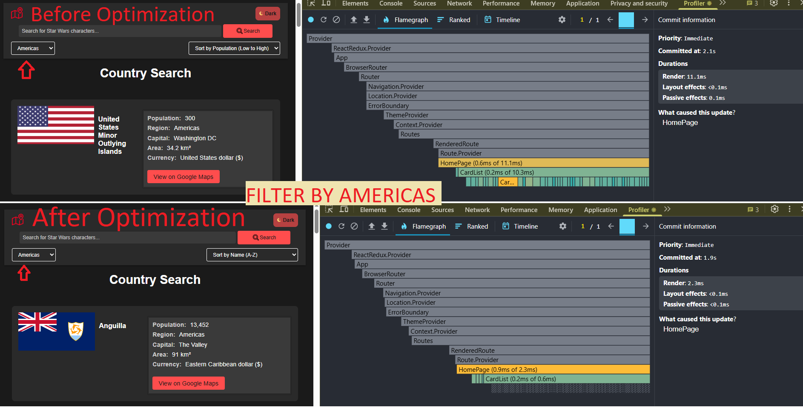
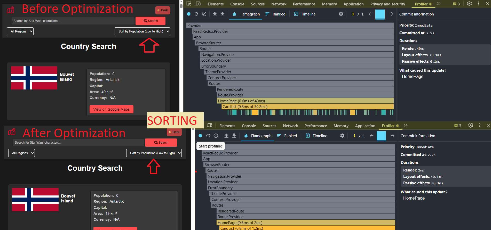
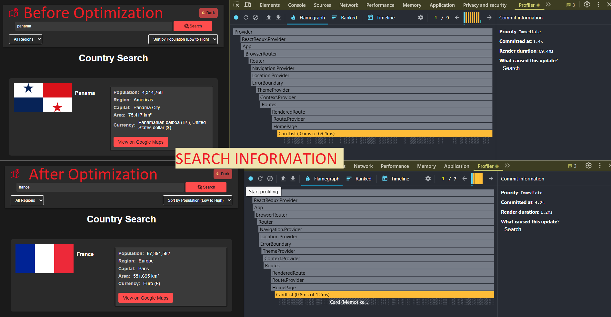

# school-react-course-tasks

## TASK 6: React Performance.

Link: https://github.com/rolling-scopes-school/tasks/blob/master/react/modules/tasks/performance.md

## To analyze the performance of your React application using the React Dev Tools Profiler, follow these steps:

1. Install React Dev Tools.
2. Open application in the browser.
3. Switch to the "Profiler" tab in React Dev Tools and click the "Record" button (a circle) to start profiling.
4. Perform the interactions you want to measure, such as:

- Typing in the search bar.
- Selecting a region from the dropdown.
- Sorting the countries by name or population.

5. Analyze the Results:

- **Commit Duration:** The time taken for React to render the committed updates.
- **Render Duration:** The time taken for individual components to render.
- **Interactions:** The user interactions that triggered the renders.
- **Flame Graph:** A visual representation of component render times.
- **Ranked Chart:** A sorted list of components by render duration.

# Performance Analysis

This document provides an overview of the performance analysis conducted on the application, including initial profiling results, optimizations implemented, and the results after optimization. The analysis is based on the following parameters:

- **Commit Duration**: Time taken for React to render the committed updates.
- **Render Duration**: Time taken for individual components to render.
- **Interactions**: User interactions that triggered the renders.
- **Flame Graph**: Visual representation of component render times.
- **Ranked Chart**: Sorted list of components by render duration.

## Performance Analysis in Get All Items

### Initial Profiling Results:

- **Commit Duration**: Not explicitly measured (related to initial data loading).
- **Render Duration**: **146.2 ms** (HomePage component).
- **Interactions**: Initial data loading and rendering of the list.
- **Flame Graph**: Showed that `HomePage` and `CardList` were the main components contributing to render time.
- **Ranked Chart**: `HomePage` and `CardList` were at the top of the list in terms of render duration.

### Results After Optimization:

- **Render Duration**: Reduced to **74.3 ms**.

---

## Performance Analysis in Filter

### Initial Profiling Results:

- **Commit Duration**: Not explicitly measured.
- **Render Duration**: **11.1 ms** (HomePage component).
- **Interactions**: Changing the filter (e.g., selecting a region).
- **Flame Graph**: Showed that `HomePage` and `CardList` rendered quickly but could be optimized further.
- **Ranked Chart**: `HomePage` and `CardList` were at the top of the list but with lower render times.

### Results After Optimization:

- **Render Duration**: Reduced to **2.3 ms**.

---

## Performance Analysis in Sorting

### Initial Profiling Results:

- **Commit Duration**: Not explicitly measured.
- **Render Duration**: **40 ms** (HomePage component).
- **Interactions**: Changing the sorting criteria (e.g., sorting by population).
- **Flame Graph**: Showed that `HomePage` and `CardList` took longer to render during sorting.
- **Ranked Chart**: `HomePage` and `CardList` were at the top of the list in terms of render duration.

### Results After Optimization:

- **Render Duration**: Reduced to **2 ms**.

---

## Performance Analysis in Search

### Initial Profiling Results:

- **Commit Duration**: Not explicitly measured.
- **Render Duration**: **69.4 ms** (HomePage component).
- **Interactions**: Typing in the search input.
- **Flame Graph**: Showed that `HomePage` and `CardList` took longer to render during search.
- **Ranked Chart**: `HomePage` and `CardList` were at the top of the list in terms of render duration.

### Results After Optimization:

- **Render Duration**: Reduced to **1.2 ms**.

---

### What Has Been Updated:

1. **`useMemo`**:

   - Used to memoize the filtered, searched, and sorted list of countries.
   - This avoids redundant calculations on every render, significantly improving performance.

2. **`useCallback`**:

   - Used to memoize event handlers for filtering, searching, and sorting.
   - This prevents the creation of new functions on every render, reducing unnecessary re-renders.

3. **`React.memo`**:

   - Wrapped components like individual country cards in `React.memo` to prevent unnecessary re-renders.
   - This ensures that components only re-render when their props change, optimizing performance.

4. **Proper Use of `key` Props**:
   - Ensured proper use of `key` props for lists to avoid reconciliation issues in React.
   - This helps React efficiently update and manage list items.

---

### Performance Improvements:

#### **Get All Items**

- **Before Optimization**: Render duration was **146.2 ms**.
- **After Optimization**: Render duration reduced to **74.3 ms**.

#### **Filter**

- **Before Optimization**: Render duration was **11.1 ms**.
- **After Optimization**: Render duration reduced to **2.3 ms**.

#### **Sorting**

- **Before Optimization**: Render duration was **40 ms**.
- **After Optimization**: Render duration reduced to **2 ms**.

#### **Search**

- **Before Optimization**: Render duration was **69.4 ms**.
- **After Optimization**: Render duration reduced to **1.2 ms**.

---

### Descriptions:

- **`useMemo`** is essential for optimizing expensive calculations, such as filtering and sorting large datasets.
- **`useCallback`** ensures that event handlers remain stable across renders, preventing unnecessary re-renders in child components.
- **`React.memo`** is a powerful tool for optimizing component re-renders, especially for lists or complex UI elements.
- Proper use of **`key` props** is critical for efficient list rendering and avoiding reconciliation issues in React.

These optimizations have significantly improved the performance and responsiveness of the application, ensuring a smoother user experience.
